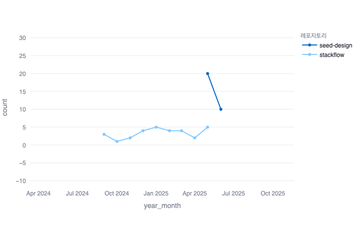
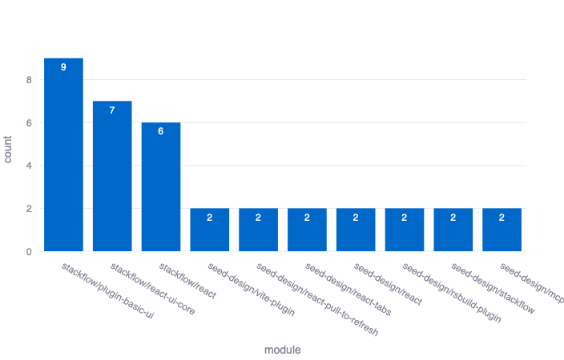
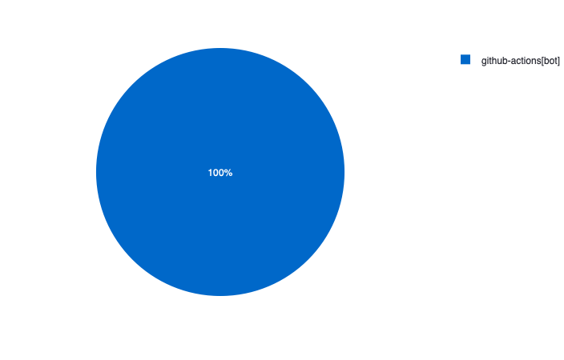

# Release Tracker: GitHub 릴리즈 데이터 분석 및 시각화 대시보드

## 소개

이 대시보드는 두 개의 GitHub 저장소(1. daangn/stackflow, 2. daangn/seed-design)의 릴리즈 데이터를 활용하여 배포 관련 통계 정보를 CSV 파일로 생성하고, 이를 시각화하여 릴리즈 현황을 직관적으로 파악할 수 있도록 만든 웹 대시보드입니다.
Streamlit과 Plotly를 사용해 개발되었으며, 주요 차트를 통해 릴리즈 추세 및 작성자 분포를 확인할 수 있습니다.

## 주요 기능

- **월별 릴리즈 추이**  
  시간에 따른 저장소별 릴리즈 수 변화를 선 그래프로 시각화합니다.

  

- **릴리즈 상위 모듈 (Top 10)**  
  릴리즈가 많은 상위 10개 모듈을 막대그래프로 나타냅니다.

  

- **작성자별 릴리즈 비율**  
  릴리즈 작성자별 배포 비율을 파이차트로 보여줍니다.

  

## 사용 기술

- Python
- Streamlit
- Pandas
- Plotly

## 실행 방법

```bash
git clone [프로젝트 URL]
cd dashboard
pip install -r requirements.txt
streamlit run app.py
```

## API 서버 실행

서버는 Fastify 기반 Node.js 서버로, CSV 파일을 읽어 데이터를 JSON API로 제공합니다.

```bash
cd server
npx ts-node index.ts

서버는 기본적으로 http://localhost:4000 에서 실행됩니다.

API 엔드포인트

경로    설명
/api/raw    원본 릴리즈 데이터 전체 조회
/api/stats    통계 데이터 전체 조회
